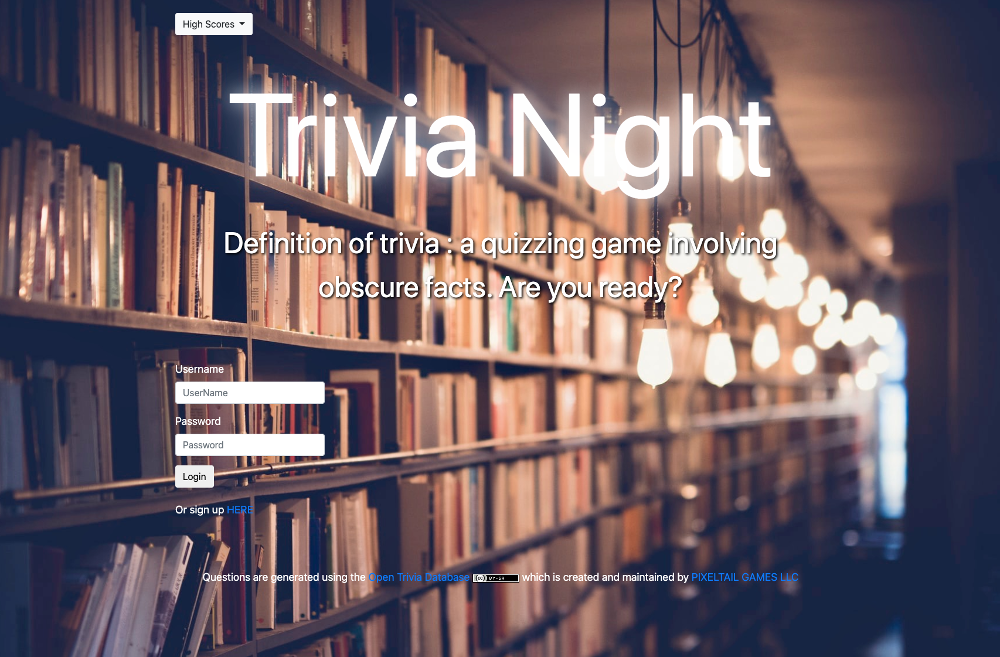

# Trivia Night

## Description
Trivia Night is a fun trivia game with persistent profile stat tracking and top scores.It uses Open Trivia DB API and generates a quiz game. Users are asked to sign up or log in, then the app displays the user's profile and allows for start of the game. The quiz consists of ten questions from different categories and difficulty types. User has 90 seconds to answer the questions and get personal stats.

## Table of Contents

#### [Technologies Used]
#### [Installation]
#### [Usage information]
#### [License]
#### [Contributing]
#### [Questions]

## Technologies Used

Node.js - for js runtime
Express - for server configuration
Sequelize ORM - for DB object relational mapping
MySQL - for housing the data
Handlebars.js - for html templating
jQuery/js - for dom manipulation
Passport.js/Bcrypt - to encrypt passwords
ESLint - to help keep code formatted correctly
animista.net - for CSS animations
bootstrap - for responsive design
html - layout
CSS - for custom style
open trivia DB - for question generation

## Installation
Install dependencies by running "npm install" from the terminal. 

## Usage information
Access application on Heroku : https://morning-ravine-45125.herokuapp.com/
Run application locally on localsost:8080 by running node server or npm start in your text editor

## License
MIT

## Contributing
Pull requests are welcome

## Questions ?
### https://github.com/nigarabdullayeva
### https://github.com/locutusOO1
### https://github.com/cd-prog
### https://github.com/nrmarsh36
>>>>>>> 780faa73009dc37bbed065ab8f022977bcc7139f
